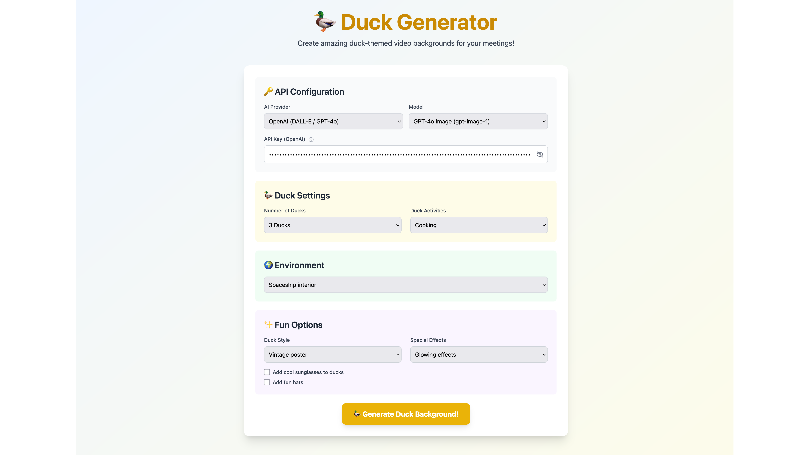

# Duck Generator 🦆

A fun web app for generating duck-themed video backgrounds using AI image generation APIs. Perfect for making your video calls more entertaining!



## Features

- 🎨 **Multiple AI Providers**: Support for OpenAI (DALL-E 2/3, GPT-4o) and Google Imagen
- 🦆 **Customizable Ducks**: Choose number of ducks, activities, and accessories
- 🌍 **33 Environments**: From outer space to cyberpunk cities
- 🎭 **8 Art Styles**: Realistic, cartoon, pixel art, anime, and more
- ✨ **Special Effects**: Rainbow, glowing, sparkles, fire, and more
- 🔐 **Secure**: API keys stored only in browser localStorage
- 📱 **Responsive**: Works on desktop and mobile devices

## Live Demo

Visit [duckgenerator.com](https://duckgenerator.com) to try it out!

## Tech Stack

- **Frontend**: [Astro](https://astro.build/) with Tailwind CSS
- **Backend**: Cloudflare Workers (Edge Functions)
- **Deployment**: Cloudflare Pages
- **AI APIs**: OpenAI DALL-E & Google Imagen

## Local Development

### Prerequisites

- Node.js 18+ installed
- npm or yarn
- API keys from OpenAI or Google Cloud

### Setup

1. Clone the repository:
```bash
git clone https://github.com/yourusername/duck-generator.git
cd duck-generator
```

2. Install dependencies:
```bash
npm install
```

3. Run the development server:
```bash
npm run dev
```

4. Open [http://localhost:4321](http://localhost:4321) in your browser

### Development with API Functions

To test the API endpoints locally:

```bash
npm run pages:dev
```

This runs the site with Cloudflare Workers locally on [http://localhost:3000](http://localhost:3000)

## Deployment

### Deploy to Cloudflare Pages

1. Fork this repository
2. Connect your GitHub account to Cloudflare Pages
3. Create a new Pages project
4. Set the following build settings:
   - Build command: `npm run build`
   - Build output directory: `dist`
5. Deploy!

### Custom Domain

To use a custom domain:
1. Add your domain in Cloudflare Pages settings
2. Update the DNS records to point to your Pages deployment

## API Keys

This app requires API keys from either:

- **OpenAI**: Get from [platform.openai.com](https://platform.openai.com/api-keys)
- **Google Cloud**: Enable Imagen API and get credentials from [Google Cloud Console](https://console.cloud.google.com/)

Your API keys are:
- Stored only in your browser's localStorage
- Never sent to any backend servers
- Used directly with the AI provider's APIs

## Usage

1. Select your AI provider (OpenAI or Google)
2. Enter your API key (saved locally for convenience)
3. Customize your duck scene:
   - Number of ducks
   - Activity (swimming, coding, dancing, etc.)
   - Environment (space, beach, office, etc.)
   - Art style and effects
   - Accessories (sunglasses, hats)
4. Click "Generate Duck Background!"
5. Download your creation

## Project Structure

```
duck-generator/
├── src/
│   ├── pages/
│   │   ├── index.astro      # Main UI
│   │   └── api/
│   │       └── generate.ts  # API endpoint (dev)
│   └── env.d.ts            # TypeScript definitions
├── functions/
│   └── api/
│       └── generate.js      # Cloudflare Worker
├── public/
│   └── og-image.png        # Social media preview
├── astro.config.mjs        # Astro configuration
├── tailwind.config.mjs     # Tailwind CSS config
├── wrangler.toml          # Cloudflare config
└── package.json
```

## Contributing

Contributions are welcome! Please feel free to submit a Pull Request.

## License

MIT License - feel free to use this for your own projects!

## Credits

Built with ❤️ by [Your Name] using:
- [Astro](https://astro.build/)
- [Tailwind CSS](https://tailwindcss.com/)
- [Cloudflare Pages](https://pages.cloudflare.com/)
- [OpenAI API](https://openai.com/api/)
- [Google Cloud AI](https://cloud.google.com/ai)

---

Have fun generating ducks for your video calls! 🦆✨